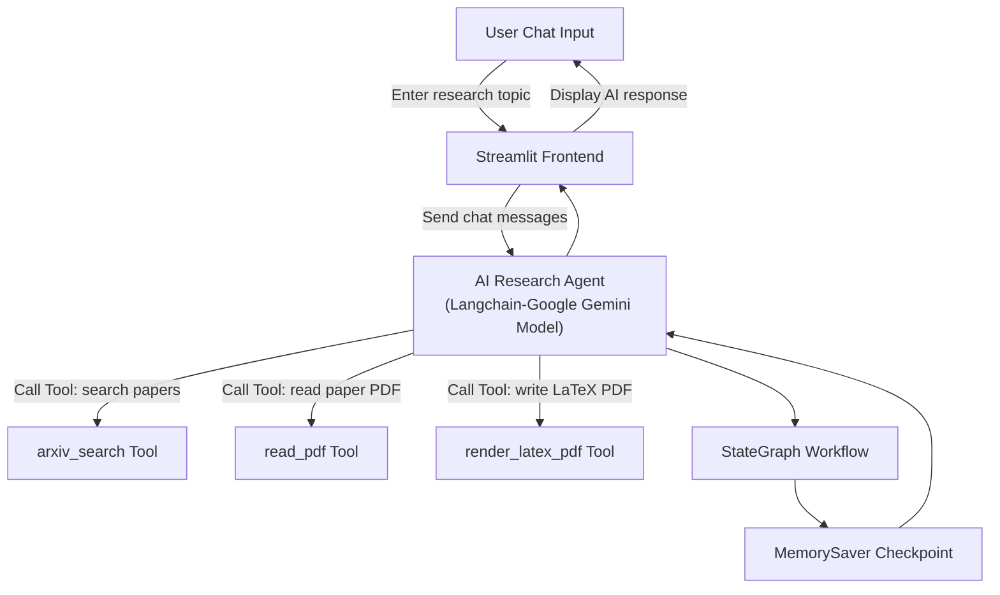

# 📄 Researcher AI Agent  

An **AI-powered research assistant** that helps explore recent research papers from **arXiv**, extract knowledge, generate new research directions, and produce a **LaTeX-based research paper (PDF)**.  

This project combines **LangGraph**, **LangChain**, and custom tools to build an **agentic workflow** that retrieves, reads, and synthesizes research—making the research process faster and more interactive.  

---

## 🚀 Features  
- 🔍 **Search latest papers** from [arXiv.org](https://arxiv.org) by topic.  
- 📖 **Read PDF papers** directly and extract structured text.  
- 🧠 **Generate research insights** and propose new directions using LLMs.  
- ✍️ **Auto-generate LaTeX research papers** with equations & references.  
- 📑 **Export clean PDFs** via [Tectonic](https://tectonic-typesetting.github.io).  
- 💬 **Interactive Chat UI** built with **Streamlit**.  
- 🐳 **Dockerized & CI/CD ready** with GitHub Actions.  

---

## 🛠️ Tech Stack  
- **Agent Framework**: [LangGraph](https://github.com/langchain-ai/langgraph), [LangChain](https://www.langchain.com/)  
- **LLMs**: [Google Gemini](https://ai.google.dev/) (Generative AI), [Groq](https://groq.com/)  
- **Tools**:  
  - `arxiv_tool.py` → Search and parse arXiv papers  
  - `read_pdf_tool.py` → Extract text from PDF papers  
  - `write_pdf_tool.py` → Render LaTeX → PDF  
- **Frontend**: [Streamlit](https://streamlit.io)  
- **Infra**: Docker, GitHub Actions (CI/CD), `.env` for API keys  

---

## 📂 Project Structure  

- `frontend.py`: Streamlit user interface and chat integration
- `ai_researcher.py`: Core AI agent workflow and state management
- `arxiv_tool.py`: Tool for searching arXiv papers
- `read_pdf_tool.py`: Tool to read and extract text from PDFs
- `write_pdf_tool.py`: Tool to render LaTeX content into PDF documents
- `.github/workflows/deploy.yaml`: GitHub Action for Docker build and push
- `Dockerfile`: Container definition for deployment
- `requirements.txt`: Python dependencies list


---

## 🏗️ Architecture  




## 🚀 Getting Started

### 1. Clone the repository
```bash
git clone https://github.com/Npps1997/Researcher-ai.git
cd Researcher-ai
```

### 2. Create virtual environment
```bash
python -m venv venv
source venv/bin/activate   # (Linux/Mac)
venv\Scripts\activate      # (Windows)
```

### 3. Install dependencies
```bash
pip install -r requirements.txt
```

### 4. Setup environment variables

Create a .env file in the project root:
```ini
GOOGLE_API_KEY=your_google_api_key
GROQ_API_KEY=your_groq_api_key
```

### 5. Run Frontend (Streamlit)
```bash
streamlit run frontend.py
```

### 6. (Optional) Run inside Docker
```bash
docker build -t researcher-ai .
docker run -p 8501:8501 researcher-ai
```

## 🤖 How It Works

1. User enters a research topic in the chat.
2. Agent searches arXiv for recent papers.
3. Papers can be read (PDF parsing) for deep insights.
4. Agent proposes new research directions.
5. Once confirmed, it generates a LaTeX research paper.
6. Paper is compiled to a PDF using Tectonic.

## 🔄 CI/CD with GitHub Actions
This repo includes a workflow file under .github/workflows/deploy.yaml:

- Runs tests (if added)
- Builds Docker image
- Deploys app automatically

## 🆕 What’s New

- Replaced MemorySaver → SQLite Checkpointer for persistence.
- Added multi-thread chat support (users can switch between past conversations).
- Sidebar now shows Chat 1, Chat 2, … instead of UUIDs.
- Cleaner UI/UX similar to ChatGPT experience.

## ⭐ Acknowledgments

- [LangGraph](https://github.com/langchain-ai/langgraph) & [LangChain](https://www.langchain.com/)
- [arXiv](https://arxiv.org)
- [Tectonic](https://tectonic-typesetting.github.io)
